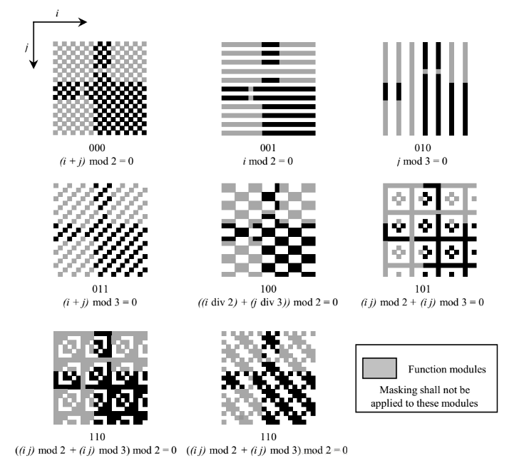
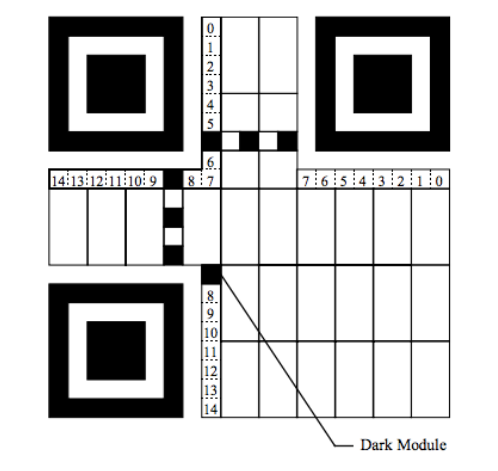
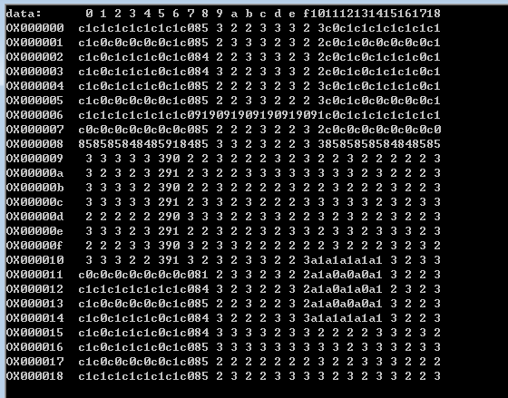

# 掩码处理#

掩模处理为了希望确保读取QR码时明暗模块均衡布置在二维码码矩阵中。在位置检测元件图案中特征性地看到的1011101的符号在位图案中尽可能多。为了满足上述条件，遵循合适的掩模处理

## 掩码处理版本

- 掩模处理不适用于功能区

- 编码区域（不包括格式信息和型号信息。）和多个掩模处理蒙版通过XOR操作按照模式进行变换。XOR运算意味着每个掩码处理矩阵模块图案叠加在图案上，模块图案对应于掩模处理图案的模块明暗要倒置（从浅到深，从暗到亮）。

- 在每个转化结果中，所有转化结果都是通过对损失点进行评分来评估的。

- 选择损失点总和最低的模式。

- 处理公式
 
	二维码有 8 种蒙版可以使用，如下图所示，公式也在图中说明，公式中的i，j是水平方向和垂直方向的坐标。因为除数据区外，其他图案填充时的高位都是1，所以当蒙版和数据区进行异或操作，不会影响与格式信息相关的功能区。

## 掩码产生实现

掩码产生过程主要是处理公式不一样，即不同坐标下为0或1。所以在实现时用了宏定义。其过程是依次遍历二维码，遇到非数据图案（类似于定位图案、时序图案等高位为1的数据）不改变其值，而数据区数据就要和掩码进行异或操作了，并且记录该掩码类型下最低位为1的元素个数，也就是二维码图片中的黑色点个数，下面是000掩码下的实现代码，其他类型只要替换掉掩码产生公式即可

		#define MASKMAKER(__exp__) \
			int x, y;\
			int b = 0;\
		\
			for(y=0; y<width; y++) {\
				for(x=0; x<width; x++) {\
					if(*s & 0x80) {\
						*d = *s;\
					} else {\
						*d = *s ^ ((__exp__) == 0);\
					}\
					b += (int)(*d & 1);\
					s++; d++;\
				}\
			}\
			return b;

		int Mask_mask0(int width, const unsigned char *s, unsigned char *d)
		{
			MASKMAKER((x+y)&1)	// 参数为掩码处理公式
		}

## 重新填充掩码、纠错等级编码的格式信息

- 数据格式：
 
	格式信息在定位图案周围分布，由于定位图案个数固定为 3 个，且大小固定，故格式信息也是一个固定 15bits 的信息。

	15bits 中数据，按照 5bits 的数据位 + 10bits 纠错位的顺序排列。

	每个 bit 的位置如下：

	

- 格式信息：

	数据位占 5bits：其中 2bits 用于表示使用的纠错等级 (Error Correction Level)，3bits 用于表示使用的蒙版 (Mask) 类别；

	纠错位占 10bits：主要通过 BCH Code 计算，但实现是直接从表里查找的：

		//	formatInfo[level][mask]
		const unsigned int formatInfo[4][8] = {
			{0x77c4, 0x72f3, 0x7daa, 0x789d, 0x662f, 0x6318, 0x6c41, 0x6976},
			{0x5412, 0x5125, 0x5e7c, 0x5b4b, 0x45f9, 0x40ce, 0x4f97, 0x4aa0},
			{0x355f, 0x3068, 0x3f31, 0x3a06, 0x24b4, 0x2183, 0x2eda, 0x2bed},
			{0x1689, 0x13be, 0x1ce7, 0x19d0, 0x0762, 0x0255, 0x0d0c, 0x083b}
		};

- 举个例子：

	纠错等级M：   00

	掩模图案参考：101

	数据：   00101

	BCH位：   0011011100

	掩码前的位串：001010011011100

	假设XOR用于计算的掩模图案：010100000100101

	格式信息模块模式：100000011001110

- 具体实现代码：

		int Mask_writeFormatInformation(int width, unsigned char *frame, int mask, QRecLevel level)
		{
			unsigned int format;
			unsigned char v;
			int i;
			int blacks = 0;
		
			format = mQrspec::QRspec_getFormatInfo(mask, level);
		
			for(i=0; i<8; i++) {
				if(format & 1) {
					blacks += 2;
					v = 0x85;
				} else {
					v = 0x84;
				}
				frame[width * 8 + width - 1 - i] = v;
				if(i < 6) {
					frame[width * i + 8] = v;
				} else {
					frame[width * (i + 1) + 8] = v;
				}
				format= format >> 1;
			}
			for(i=0; i<7; i++) {
				if(format & 1) {
					blacks += 2;
					v = 0x85;
				} else {
					v = 0x84;
				}
				frame[width * (width - 7 + i) + 8] = v;
				if(i == 0) {
					frame[width * 8 + 7] = v;
				} else {
					frame[width * 8 + 6 - i] = v;
				}
				format= format >> 1;
			}
		
			return blacks;	//	返回暗点个数
		}

## 选择合适的掩码版本

掩模处理结果的评估发生在对每个掩模图案依次执行掩模处理和填充纠错码、掩码版本格式信息之后的评估结果。分数越高，接受结果就越难。

评估过程：

- 总黑暗模块的百分比评分：

	首先计算该在该掩码处理版本后暗点图案的个数，再加上进行格式信息填充后格式信息部分的暗点个数，计算占整个二维码所有明暗点的百分比。然后百分比从50点增加或减少5%时加10点。例如暗点模块的百分比是45或55，得分则为10；

		blacks = maskMakers[i](width, frame, mask);	// 使用mask版本进行掩码运算，并返回黑点个数
		blacks += Mask_writeFormatInformation(width, mask, i, level);	//	重新填充上掩码版本、纠错等级的格式信息，并返回黑点个数
		bratio = (200 * blacks + w2) / w2 / 2; /* (int)(100*blacks/w2+0.5) */		//	黑点个数占整个二维码的百分比
		demerit = (abs(bratio - 50) / 5) * N4;	//abs(bratio-50)*2

- 相同颜色行或列的相邻模块评分：
	
	对于水平和垂直方向，五个或更多光（白色）模块或暗（黑色）模块是连续的计算块数。顺便说一下，连续五个区块的每个区块的损失得分为3分，连续六个区块每个区块得4分，每次块数增加时，它都会增加1。例如有一块连续7个暗黑的模块，在这种情况下，七个连续模块被视为一个块，并且每个模块的得分是5。

- 行/列中的1：1：3：1：1比例模式评分：

	1：1：3：1：1：在出现 明：暗：明 这种明暗图案比例的图案之后，如果有一个宽度大于比率4的明图案，则得分为40分。

	以上两种评分方式的实现：

		int Mask_evaluateSymbol(int width, unsigned char *frame)
		{
			int x, y;
			int demerit = 0;
			int runLength[QRSPEC_WIDTH_MAX + 1];
			int length;
		
			demerit += Mask_calcN2(width, frame);
		
			for(y=0; y<width; y++) {
				length = Mask_calcRunLength(width, frame + y * width, 0, runLength);
				demerit += Mask_calcN1N3(length, runLength);
			}
		
			for(x=0; x<width; x++) {
				length = Mask_calcRunLength(width, frame + x, 1, runLength);
				demerit += Mask_calcN1N3(length, runLength);
			}
		
			return demerit;
		}

		int Mask_calcN1N3(int length, int *runLength)
		{
			int i;
			int demerit = 0;
			int fact;
		
			for(i=0; i<length; i++) {
				if(runLength[i] >= 5) {
					demerit += N1 + (runLength[i] - 5);	// N1=3
					//n1 += N1 + (runLength[i] - 5);
				}
				if((i & 1)) {
					if(i >= 3 && i < length-2 && (runLength[i] % 3) == 0) {
						fact = runLength[i] / 3;
						if(runLength[i-2] == fact &&
						   runLength[i-1] == fact &&
						   runLength[i+1] == fact &&
						   runLength[i+2] == fact) {
							if(i == 3 || runLength[i-3] >= 4 * fact) {
								demerit += N3;	//N3=40
								//n3 += N3;
							} else if(i+4 >= length || runLength[i+3] >= 4 * fact) {
								demerit += N3;
								//n3 += N3;
							}
						}
					}
				}
			}
		
			return demerit;
		}

- 相同颜色的模块块

	计算2×2块暗或亮的数量，并将该数量计为得分。例如，黑暗3×3由于块中有4个暗2×2块，我们得分为4×3 = 12。

		int Mask_calcN2(int width, unsigned char *frame)
		{
			int x, y;
			unsigned char *p;
			unsigned char b22, w22;
			int demerit = 0;
		
			p = frame + width + 1;
			for(y=1; y<width; y++) {
				for(x=1; x<width; x++) {
					b22 = p[0] & p[-1] & p[-width] & p [-width-1];
					w22 = p[0] | p[-1] | p[-width] | p [-width-1];
					if((b22 | (w22 ^ 1))&1) {
						demerit += N2;	// N2=3
					}
					p++;
				}
				p++;
			}
		
			return demerit;
		}

- 计算所有的评分结果并选择评分最低也就是最合适的掩码处理版本实现

		unsigned char *mMask::Mask_mask(int width, unsigned char *frame, QRecLevel level)
		{
			int i;
			unsigned char *mask, *bestMask;
			int minDemerit = INT_MAX;
			int blacks;
			int bratio;
			int demerit;
			int w2 = width * width;
		
			mask = (unsigned char *)malloc(w2);
			if(mask == NULL) return NULL;
			bestMask = NULL;
		
			for(i=0; i<maskNum; i++) {
				demerit = 0;
				blacks = maskMakers[i](width, frame, mask);	// 使用mask版本进行掩码运算，并返回黑点个数
				blacks += Mask_writeFormatInformation(width, mask, i, level);	//	重新填充上掩码版本、纠错等级的格式信息，并返回黑点个数
				bratio = (200 * blacks + w2) / w2 / 2; /* (int)(100*blacks/w2+0.5) */		//	黑点个数占整个二维码的百分比
				demerit = (abs(bratio - 50) / 5) * N4;	//N4=10 ->abs(bratio-50)*2	
				demerit += Mask_evaluateSymbol(width, mask);
				if(demerit < minDemerit) {
					minDemerit = demerit;
					free(bestMask);
					bestMask = mask;
					mask = (unsigned char *)malloc(w2);
					if(mask == NULL) break;
				}
			}
			free(mask);
			return bestMask;
		}

		int Mask_evaluateSymbol(int width, unsigned char *frame)
		{
			int x, y;
			int demerit = 0;
			int runLength[QRSPEC_WIDTH_MAX + 1];
			int length;
		
			demerit += Mask_calcN2(width, frame);
		
			for(y=0; y<width; y++) {
				length = Mask_calcRunLength(width, frame + y * width, 0, runLength);
				demerit += Mask_calcN1N3(length, runLength);
			}
		
			for(x=0; x<width; x++) {
				length = Mask_calcRunLength(width, frame + x, 1, runLength);
				demerit += Mask_calcN1N3(length, runLength);
			}
		
			return demerit;
		}

选择好了最合适的掩码处理版本后，我们的得到了最终的二维码模块数据。

## 至此，掩码处理完成
	
- 到此过程，可以将以上生成的数据放到位图中，显示如下：

	

- 模块数据展示：

	
	

## 前后过程链接

- 上一过程

	[填充数据码和纠错码](./originaldatafill.md)

- 下一过程

	生成图片：生成图片没什么难度，自己查看我的代码就行

- 总览

	[README](../README.md)