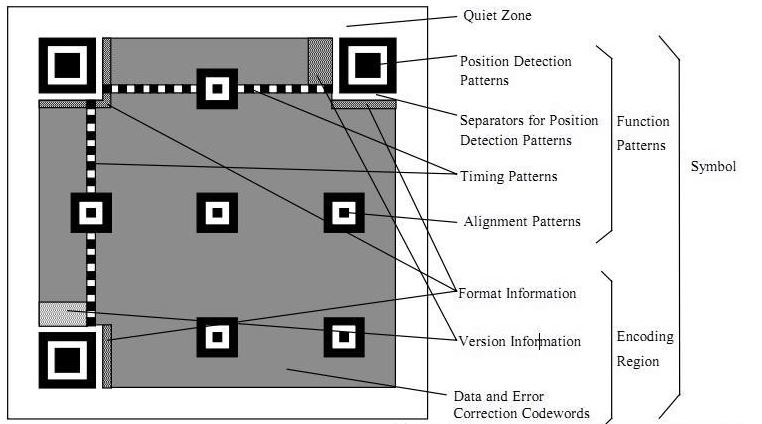

# QRCodeLib --一个基于libqrencode库的Model 1版二维码生成器及生成过程详细剖析#

## [相关笔记与demo]()

[字符串数据编码](./QR/CodeGenerator.md)

[计算纠错码字](./QR/EccSpec.md)

[编码数据结构化填充](./QR/DataFill.md)

[填充数据码和纠错码](./QR/originaldatafill.md)

[掩码处理](./QR/Maskk.md)

[二维码标准JIS X0510:2004参考](http://www.kikakurui.com/x0/X0510-2004-01.html)

## QRCode是什么？

QRCode是二维码，它被分类为矩阵码。QRcode的样本图片如下。

QRcode的特点是

- 高速读数（QR源自“快速响应”）
- 高容量和高密度
- 纠错
- 结构化附加

实现的二维码生成模型 Model 1 QRcode的特点是

- 角落里有三个定位器图案
- 放置定位器周围的格式信息
- 连接定位器的一行和一列中的定时标记
- 沿右下边缘的延伸图案
- 安静的区域4个模块围绕符号

### 可以用QRCode编码的字符。（编码模式）

- 数字（0-9）

	3个字符编码为10位长度。

	理论上，可以在QRcode中存储7089个字符或更少的字符。

- 字母数字

	（0-9A-Z $％* + - ./ :)45个字符2个字符编码为11位长度。

	理论上，可以在QRcode中存储4296个字符或更少的字符。 

- 8位字节数据

	理论上，可以在QRcode中存储2953个字符或更少。

- KANJI 

	KANJI字符（这是多字节字符）编码为13位长度。

	理论上，可以在QRcode中存储1817个字符或更少的字符。

### QRCode纠错

QRcode具有纠错错误的功能，即使图片上有些点白色为黑色。

纠错在4级定义如下:

- 级别L：可以纠正大约7％或更少的错误。

- 级别M：可以纠正大约15％或更少的错误。

- 级别Q：可以纠正大约25％或更少的错误。

- 级别H：可以纠正大约30％或更少的错误。

### QRcode版本。

QRcode的大小定义为版本，版本从1到40. 

版本1开始是21 * 21矩阵。每增加1个版本，就会增加4个模块。

因此版本40是177 * 177矩阵。

###  QRcode符号的结构

二维码结构如下图所示：

二维码的各部分都有自己的作用，基本上可被分为定位、功能数据、数据内容三部分。

- 定位图案： 

	Position Detection Pattern, 定位图案：用于标记二维码矩形的大小；用三个定位图案即可标识并确定一个二维码矩形的位置和方向了；

	Separators for Position Detection Patterns, 定位图案分割器：用白边框将定位图案与其他区域区分；
	
	Timing Patterns, 时序图案：用于定位，二维码如果尺寸过大，扫描时容易畸变，时序图案的作用就是防止扫描时畸变的产生；

	Alignment Patterns, 对齐图案：只有在 Version 2 及其以上才会需要；

- 功能数据： 

	Format Information, 格式信息：存在于所有尺寸中，存放格式化数据；

	Version Information, 版本信息：用于 Version 7 以上，需要预留两块 3×6 的区域存放部分版本信息；

- 数据内容：剩余部分存储数据内容 

	Data Code, 数据码；

	Error Correction Code, 纠错码；

## QRCodeLib的使用

项目将二维码生成的细节都隐藏了起来，而把生成所关心的样式等设置都集成在"mQrBitMapEncoder.h"中的mQrBitMapEncoder类里面。

使用mQrBitMapEncoder类生成二维码数据很简单：只需要初始化一个mQrBitMapEncoder对象，然后设置二维码的颜色、像素大小、版本、区分大小写、编码模式、纠错码类型即可，然后调用其Encode方法就可以对其参数进行编码，可以调用showbits接口查看生成的二进制编码，并使用Save接口保存编码到图片进行查看。

如果对二维码的生成过程感兴趣，可以查看文章顶部的相关链接。

### Demo示例

	#include "stdafx.h"
	#include <string.h>
	#include <errno.h>
	#include <conio.h>
	#include <ctype.h>
	#include <stdio.h>
	#include <stddef.h>
	#include <stdlib.h>
	#include <wchar.h>
	
	#include "mQrencode.h"
	#include "mQrBitMapEncoder.h"
	#include <iostream>
	
	
	#define QRCODE_TEXT "abcdefg!!!!!!!@#$%hijk123131lmn"						// Text to encode into QRCode
	#define OUT_FILENEW					"d:/testmmm.bmp"								// Output file name
	
	
	
	int test_tmain(int argc, _TCHAR* argv[])
	{	
		// Compute QRCode
	
		mQrBitMapEncoder mbitmap;
		mbitmap.setPexelPrescaler(6);	// set number of pixels in bmp file for each QRCode pixel, on each dimension
		mQrBitMapEncoder *coder = mbitmap.Encode(QRCODE_TEXT);	// encode content of qrcode
		if (!coder)
		{
			coder->showWarning();
		}
	
		if (!coder->Save(OUT_FILENEW))	// save image in output file path
		{
			mbitmap.showWarning();
			exit(-1);
		}
		
		coder->showbits();
		
		return 0;
	}

### 生成图片示例：

扫描出来的结果就是abcdefg!!!!!!!@#$%hijk123131lmn

## 后记

QRCodeLib生成二维码的编码数据的过程主要是参考 Kentaro Fukuchi <kentaro@fukuchi.org> 的代码，想深入了解和研究可以阅读其原始代码，或者参考该项目代码以及查看文首相关链接。

二维码的资料和制定的标准都很多，也凝聚了不少研究着的心血，同时实现过程也很困难和吸引人，不放弃就是啦。

## 联系我

714696209@qq.com | YxjYxj1907@outlook.com

